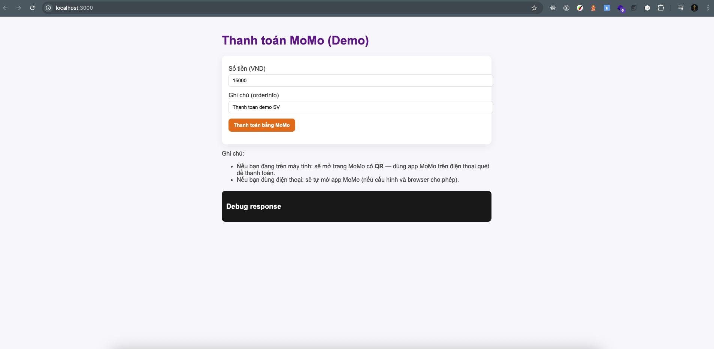
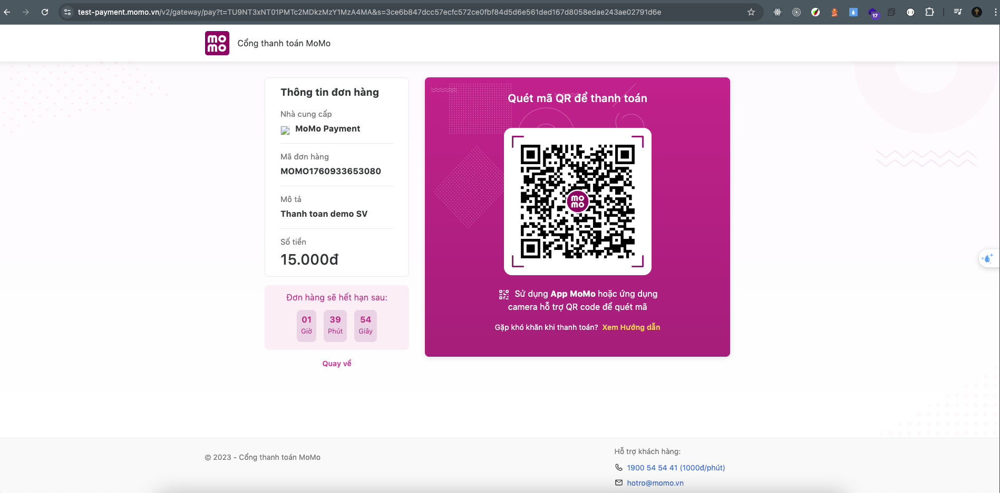
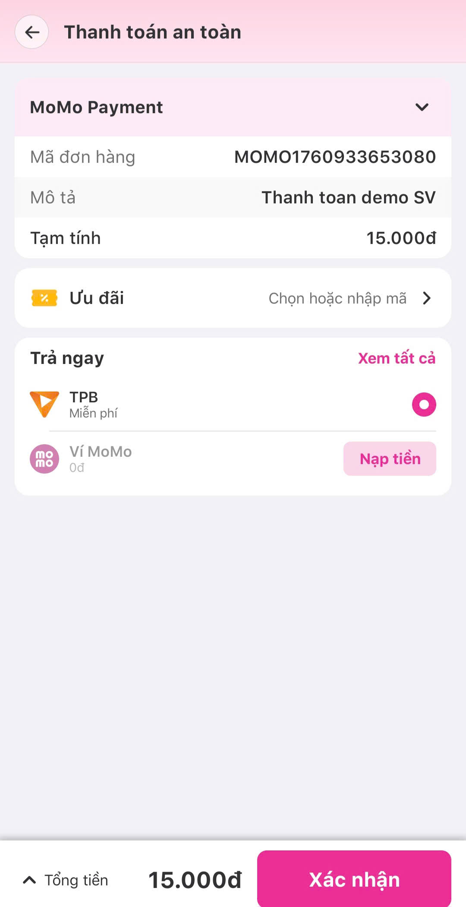
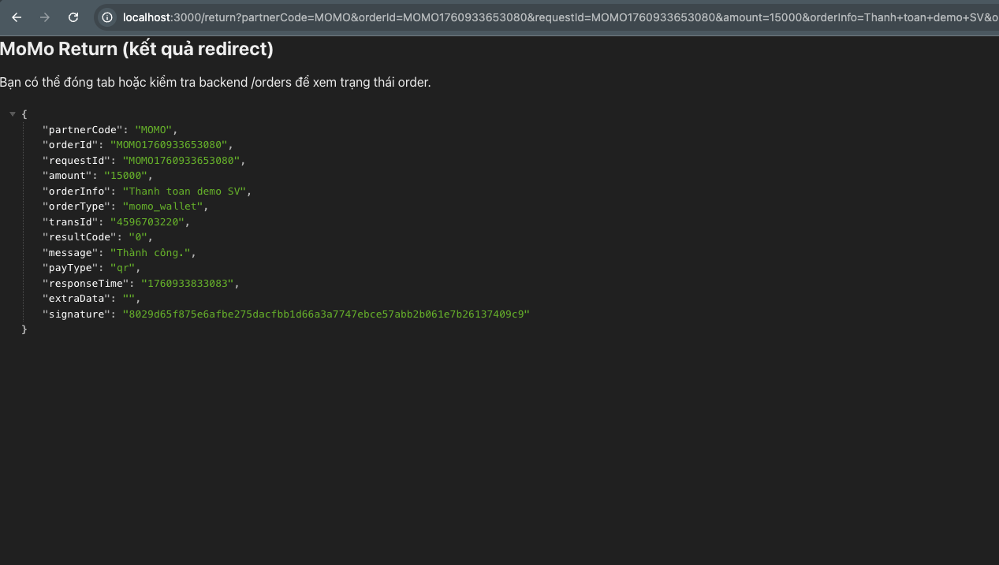

**# Hướng dẫn chạy demo thanh toán VNPay bằng NodeJS
**

## 0. Demo sản phẩm (Luồng thanh toán MoMo)

### 1️⃣ Bắt đầu thanh toán (Frontend gọi API)


---

### 2️⃣ Chuyển sang cổng thanh toán MoMo


---

### 3️⃣ Người dùng mở App MoMo và xác nhận thanh toán


---

### 4️⃣ MoMo redirect về Backend (return + IPN gửi data)



# 1. Luồng xử lý

```
User (Frontend)
   |
   | 1. Nhấn "Thanh toán"
   ▼
Backend (Server)
   | - Tạo orderId
   | - Gọi API MoMo (signature)
   | - Nhận payUrl
   ▼
Frontend
   | 2. Redirect sang payUrl (MoMo)
   ▼
MoMo Gateway (UI)
   | 3. User mở app MoMo / quét QR -> thanh toán
   |
   | Sau khi thanh toán:
   |    ├─ Redirect về returnUrl (trên browser)
   |    └─ Gửi IPN về notifyUrl (server-to-server)
   ▼
Backend
   | 4. Xác minh chữ ký, cập nhật DB
   ▼
Hoàn tất

```

---
## 📚 Dạy Học Online

Bên cạnh tài liệu miễn phí, mình còn mở các khóa học online:

- **Lập trình web cơ bản → nâng cao**
- **Ứng dụng về AI và Automation**
- **Kỹ năng phỏng vấn & xây CV IT**

### Thông Tin Đăng Ký

- 🌐 Website: [https://profile-forme.com](https://profile-forme.com)
- 📧 Email: nguyentientai10@gmail.com
- 📞 Zalo/Hotline: 0798805741

---

## 💖 Donate Ủng Hộ

Nếu bạn thấy các source hữu ích và muốn mình tiếp tục phát triển nội dung miễn phí, hãy ủng hộ mình bằng cách donate.  
Mình sẽ sử dụng kinh phí cho:

- 🌐 Server, domain, hosting
- 🛠️ Công cụ bản quyền (IDE, plugin…)
- 🎓 Học bổng, quà tặng cho cộng đồng

### QR Code Ngân Hàng

Quét QR để ủng hộ nhanh:


**QR Code ABBank**  
- Chủ tài khoản: Nguyễn Tiến Tài  
- Ngân hàng: NGAN HANG TMCP AN BINH  
- Số tài khoản: 1651002972052

---

## 📞 Liên Hệ

- 🎥 TikTok Source: [@hoclaptrinhvui](https://www.tiktok.com/@hoclaptrinhvui)
- 📚 Tiktok Dạy Học: [@code.web.khng.kh](https://www.tiktok.com/@code.web.khng.kh)
- 💻 GitHub: [fdhhhdjd](https://github.com/fdhhhdjd)
- 📧 Email: [nguyentientai10@gmail.com](mailto:nguyentientai10@gmail.com)

Cảm ơn bạn đã quan tâm & chúc bạn học tập hiệu quả! Have a nice day <3!!
